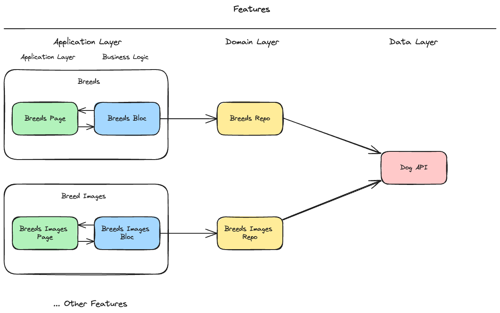

# Breed Flutter Challenge

A simple app to show a list of dog breeds and their images,
built with Flutter and the [Dog API](https://dog.ceo/dog-api/).

## Features

- List of dog breeds and sub breeds
- List of images of a breed or sub breed
- Random image of a breed or sub breed

## Architecture

The architecture is based on the Clean Architecture, with some changes to make it more simple.
Every page is a feature, and every feature has its own bloc, repository and view.
The bloc is responsible for the business logic, the repository is responsible for the data access,
and the view is responsible for the UI.

## Dependencies

1. Flutter and Dart installed on your system (Channel stable)
2. lcov installed on your system (`brew install lcov`) to generate the coverage report
3. Make installed on your system to run commands from the Makefile

## How to run the project

1. Clone the project
2. Run `flutter pub get`
3. Run `make build_runner` to generate dependencies files
4. Run `flutter run`

## Unit tests

1. Run `make test-unit` to run the unit tests
2. Run `make test-coverage` to run the tests and generate the coverage report

Tested all business logic and repositories.

## Golden tests

1. Run `make test-golden` to run the golden tests and generate the golden files

Tested pages and widgets.

## Integration tests

1. Run `make test-integration` to run the integration tests

There are different libraries to run integration tests, I chose to use the Flutter test_integration library.
Others awesome libraries are: Fluttium, Patrol, Honey.
